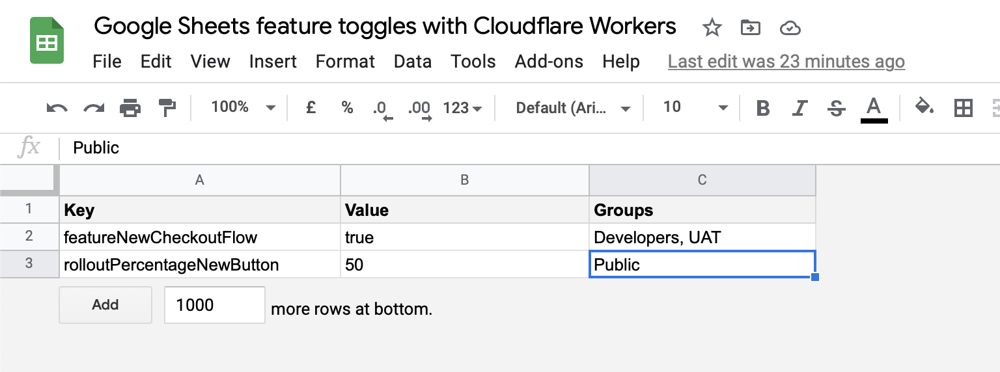
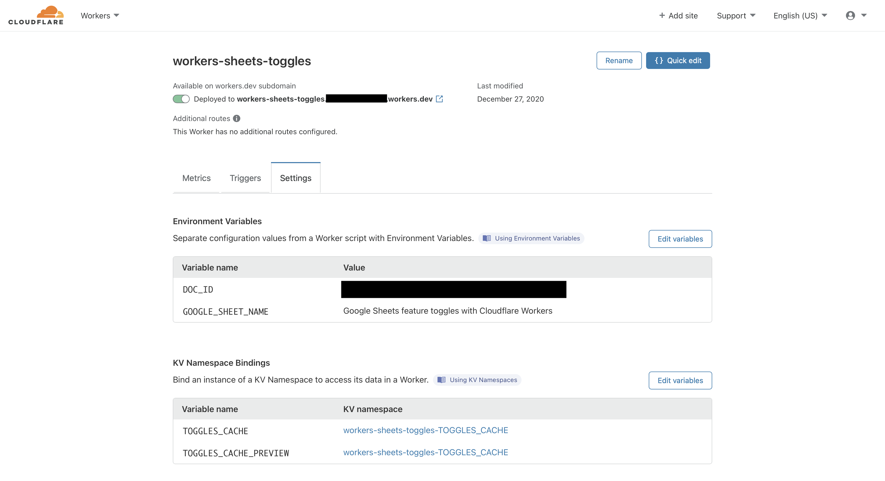

# Feature toggles engine on Google Sheets and Cloudflare Workers with KV edge-side storage

You wanted the fastest, you got the fastest! What feature toggles engine has always been right under your nose, dead easy to use and free? Google Sheets of course. And what's the fastest serverless functions service today? Cloudflare Workers, of course. So like pairing vanilla and chocolate, this repo demonstrates how you can combine these brilliant services to finally implement those feature toggles you never got around adding.

Your document is provided and formatted for easy consumption, and gets cached in Cloudflare Workers KV as long as you like (default 60 seconds). A normal non-cached request takes around ~500-1000 ms for me, and a cached request clocks in around ~30ms on my end.

## Example request

`GET https://feature-toggles-get.YOUR_ZONE.workers.dev/`

```
[
  {
    "Key": "featureNewCheckoutFlow",
    "Value": "true",
    "Groups": "Developers, UAT"
  },
  {
    "Key": "rolloutPercentageNewButton",
    "Value": "50",
    "Groups": "Public"
  }
]
```

## Prerequisites

### Google Sheets

You will need a basic Google Sheets document before moving on to the Cloudflare bits. The document has to be public for any of this to work.

The function will request a Google Sheet with your own values as per `https://docs.google.com/spreadsheets/d/{{DOC_ID}}/gviz/tq?tqx=out:json&sheet={{GOOGLE_SHEETS_NAME}}`.

#### Be careful about formatting!

You should be able to use any arbitrary number of headers (and names) and rows. I've used `Key`, `Value`, `Groups` myself.



It's normally a pain to combine types in the same column and get them out correctly, but setting columns to plain text will in turn break headers (read below how I fixed this).

I'll guide you to my proposed way of setting up the document (and this should work, as this is what I've tested and built against). I tend to set things like so:

- Horizontal align everything
- Vertical align everything
- Wrap everything
- Set all to Format > Number > Plain text

Make sure to remove any excess columns and rows as well.

**Note**: In the code I do a check for the value of `data.cols.parsedNumHeaders`. If the value is `0` the header row failed to be parsed as a regular header and was parsed as a row instead. You don't have to care too much about that implementation detail, but now you know how it works.

### Cloudflare (Wrangler + KV)



Since this uses [Cloudflare Workers](https://workers.cloudflare.com) and [KV](https://www.cloudflare.com/products/workers-kv/), you need to have a Cloudflare account.

I assume you have [Wrangler](https://github.com/cloudflare/wrangler) installed.

Also make sure to set all the empty fields to your own values inside of `wrangler.toml`. It's OK to have spaces in your name, the function will replace them with `%20`. Once you run the init script you will receive values for `kv-namespaces` that you can plug in into the TOML file.

## Develop and test

Run `wrangler dev`. You can also just log into Cloudflare and use the "quick edit" view for any development work.

## Deployment

I've added a few helpers in `package.json`:

- `init`: Create Cloudflare resources (KV, function, env vars)
- `deploy`: Deploy with Wrangler or just do `wrangler publish`

Run these like you would run any regular NPM stuff, eg. `npm run deploy`.

## Resources

- [Wrangler on GitHub](https://github.com/cloudflare/wrangler)
- [Reference: KV API](https://developers.cloudflare.com/workers/reference/apis/kv/)
